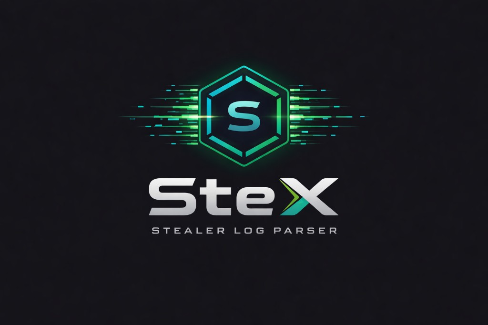

<p align="center">
  
</p>

<p align="center">
  <b>Web-based stealer log parser that automatically extracts, analyzes, and displays credentials from malware stealer log archives.</b>
</p>

<p align="center">
  
  
  
  
</p>

---

## Features

- **8 Stealer Parsers** — Redline, Raccoon, Vidar, META, Aurora, RisePro, Lumma, StealC + generic fallback
- **Archive Support** — RAR, ZIP, 7Z, TAR, TAR.GZ
- **Auto File Watcher** — Monitors `uploads/` folder, auto-parses new archives
- **Global Search** — Search credentials across all parsed archives
- **Combo Export** — Export in `user:pass`, `url|user|pass`, `email:pass` formats
- **Interesting Finds** — Auto-detects banking, crypto, admin panel, email, social media, gaming, and cloud credentials
- **Duplicate Detection** — Finds same credentials across different archives (botnet/reseller detection)
- **SQLite Persistence** — Parse results survive server restarts
- **Thread-Safe** — Background watcher and web UI operate concurrently without conflicts

## Quick Start (Docker)

```bash
docker compose up -d
```

Open `http://localhost:5000` and drop stealer log archives into the `uploads/` folder.

## Quick Start (Manual)

```bash
pip install -r requirements.txt
python app.py
```

Server starts at `http://localhost:5000`.

## Usage

1. Place `.rar`, `.zip`, `.7z`, or `.tar.gz` stealer log archives into the `uploads/` folder
2. The file watcher auto-detects and parses new archives
3. View parsed data through the web dashboard
4. Use **Global Search** to find credentials across all archives
5. Use **Duplicates** page to identify cross-archive credential overlaps
6. Export data as JSON, CSV, or combo list formats

## Project Structure

```
├── app.py                  # Flask application & routes
├── config.py               # Configuration
├── database.py             # SQLite persistence layer
├── models.py               # Data models (Password, Cookie, etc.)
├── highlights.py           # High-value credential detection
├── extractors/
│   └── archive.py          # Archive extraction (RAR/ZIP/7Z/TAR)
├── parsers/
│   ├── base.py             # Abstract base parser
│   ├── detector.py         # Stealer type auto-detection
│   ├── redline.py          # Redline parser
│   ├── raccoon.py          # Raccoon parser
│   ├── vidar.py            # Vidar parser
│   ├── meta_stealer.py     # META parser
│   ├── aurora.py           # Aurora parser
│   ├── risepro.py          # RisePro parser
│   ├── lumma.py            # Lumma parser
│   └── stealc.py           # StealC parser
├── templates/              # Jinja2 HTML templates
├── static/                 # CSS & JS assets
├── uploads/                # Drop archives here
├── Dockerfile
└── docker-compose.yml
```

## Supported Stealer Formats

| Stealer | Detection Method |
|---------|-----------------|
| Redline | `UserInformation.txt` + `Passwords.txt` |
| Raccoon | `System Info.txt` + `Passwords.txt` (no cookies dir) |
| Vidar | `information.txt` |
| META | `Passwords.txt` + cookies/autofill directories |
| Aurora | `autofills.txt` + `system.txt` |
| RisePro | `Passwords.txt` + browsers directory |
| Lumma | `System Info.txt` (fallback) |
| StealC | `system_info.txt` + `Passwords.txt` |

## Environment Variables

| Variable | Default | Description |
|----------|---------|-------------|
| `STEX_SECRET_KEY` | random | Flask secret key |

## License

For educational and authorized security research purposes only.
